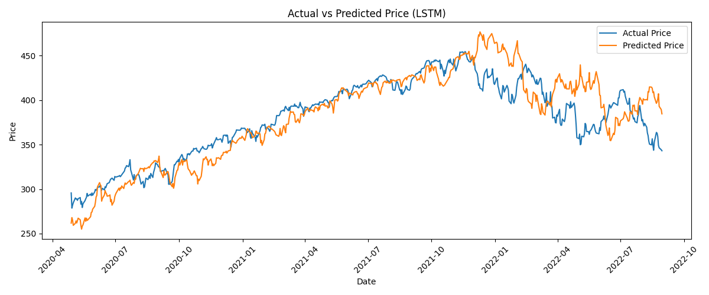
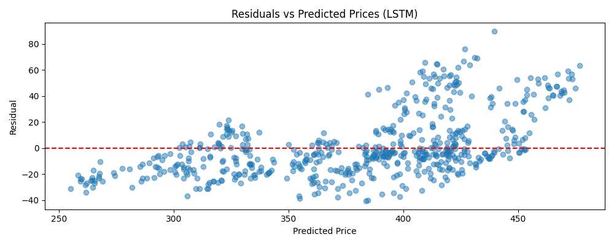

# Stock Price Prediction Using Machine Learning

This project compares two approaches for forecasting stock prices: a recurrent neural network (LSTM) and a traditional linear regression model. The models are trained to predict **30-day log returns** for the SPY ETF using historical closing prices. The goal is to evaluate how each model performs on unseen data using backtest-style evaluation.

---

## Overview

- **Target**: 30-day log returns of SPY (S&P 500 ETF)
- **Models**:
  - LSTM using TensorFlow
  - Linear Regression using scikit-learn
- **Evaluation**: R² score and Mean Squared Error (MSE)
- **Output**: Predicted log returns, reconstructed price predictions, and visualizations

---

## Project Structure

```
stock-prediction-ml/
│
├── StockDataAnalyzer.py   # Downloads OHLCV data and computes technical features 
├── prepare_data.py        # Cleans and formats raw historical SPY data
├── split_data.py          # Train/val/test splitting using rolling window
├── model_train.py         # Model training logic (LSTM + Linear)
├── run_pipeline.py        # Trains models and evaluates on validation set
├── run_test.py            # Evaluates trained models on test set
│
├── models/                # Saved trained models (LSTM .h5, linear .pkl)
├── results/
│   ├── plots/             # All saved evaluation plots
│   ├── metrics.csv        # R² and MSE scores for each model and dataset
│   ├── lstm_predictions.csv     # LSTM test predictions
│   └── linear_predictions.csv   # Linear test predictions
│
├── requirements.txt       # Core dependencies
├── .gitignore             # Prevents committing models/results
└── README.md              # Project overview
```

---

## How to Use

1. Install dependencies:
   ```bash
   pip install -r requirements.txt
   ```

2. Run training & validation pipeline:
   ```bash
   python run_pipeline.py
   ```

3. Run on test set:
   ```bash
   python run_test.py
   ```

The `results/` folder will contain evaluation metrics (CSV) and plots for both models on both validation and test data.

---

## Sample Output Plots

**LSTM: Validation Price vs Prediction**



**Linear Regression: Validation Price vs Prediction**


**LSTM: Residuals**



---

## Key Observations

- **LSTM** demonstrated a stronger ability to recognize and adapt to market volatility. Its predictions responded more dynamically to sharp price movements, allowing it to better track swings in both rising and falling markets.
- **Linear Regression** behaved more like a lagged version of the actual price. Its forecasts were slower to react to turning points, often underestimating or overshooting trends due to its static, linear structure and lack of memory.
- Both models are evaluated using R² and MSE to measure prediction accuracy on log returns.


---

## License

This project is open-source under the MIT License.
